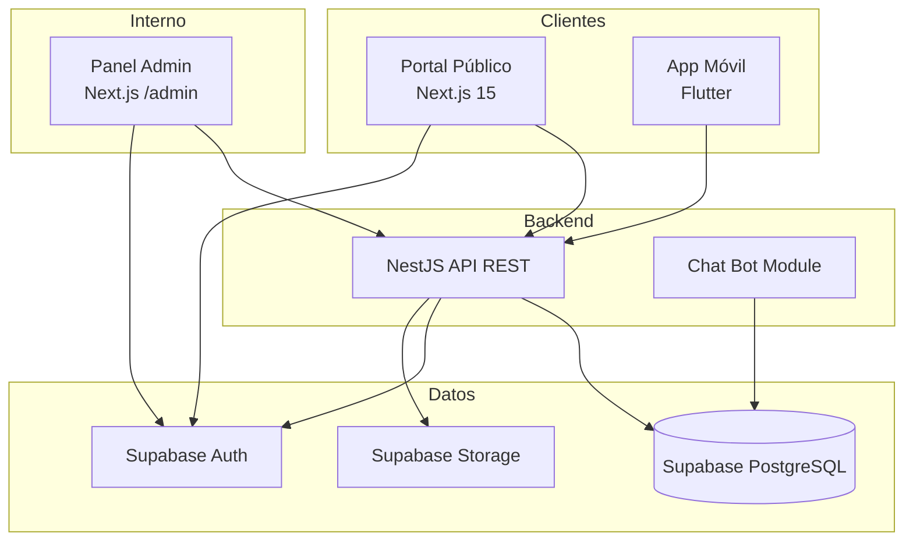
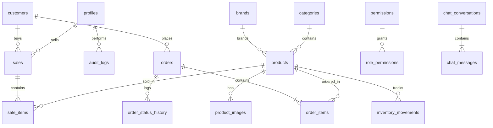
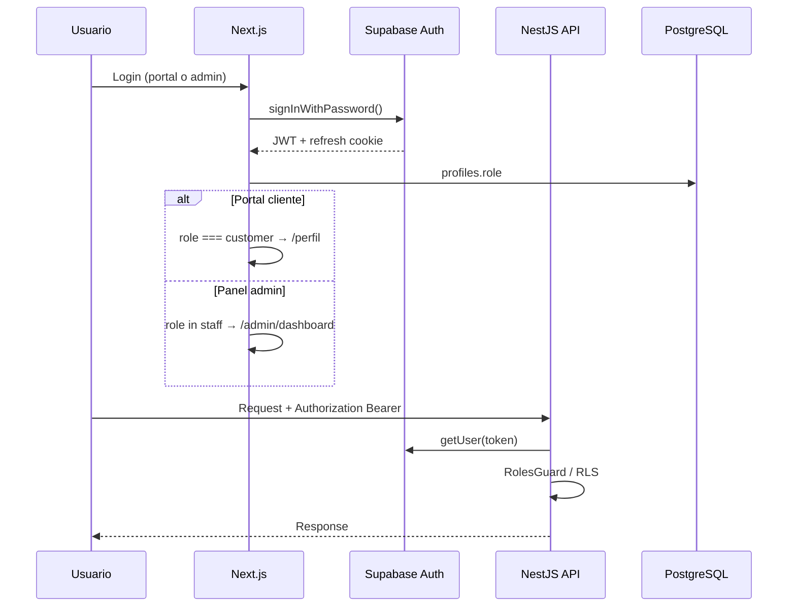

# Arquitectura del Sistema — La Merced PyK

Documento de arquitectura para **Multiservicios La Merced PyK S.A.C.**

## 1. Visión general

Sistema multiplataforma con **dos aplicaciones frontales separadas** sobre una API REST compartida:

| Sistema | URL | Audiencia |
|---------|-----|-----------|
| Portal Público | `https://empresa.com` | Clientes y visitantes |
| Panel Admin | `https://empresa.com/admin` | Personal interno (staff) |
| API REST | `https://api.empresa.com/api/v1` | Web, móvil, integraciones |
| App Móvil | Flutter (iOS/Android) | Staff y clientes |



## 2. Separación Portal vs Admin

### Principio

El portal público y el panel administrativo comparten **solo**:
- Design system base (Tailwind, tokens CSS)
- Componentes UI genéricos (`components/ui/`)
- Cliente Supabase y API
- Tipos TypeScript

**No comparten** layouts, navegación ni rutas de negocio.

### Portal Público `(public)/`

- SEO optimizado (metadata por página)
- Carrito y favoritos en localStorage (sync futuro con BD)
- Auth de **clientes** (`role: customer`)
- Sin exposición de endpoints administrativos

### Panel Admin `(admin)/admin/`

- UI oscura / corporativa independiente
- Middleware protege `/admin/*` (excepto `/admin/login`)
- Solo roles staff: `super_admin`, `admin`, `seller`, `warehouse`
- Auditoría de acciones vía `audit_logs`

## 3. Modelo de datos (PostgreSQL)

### Entidades principales



### Tablas clave

| Tabla | Propósito |
|-------|-----------|
| `profiles` | Usuario extendido (rol, datos) |
| `permissions` / `role_permissions` | RBAC configurable |
| `products`, `categories`, `brands` | Catálogo |
| `inventory_movements` | Trazabilidad de stock |
| `sales`, `sale_items` | POS tienda física |
| `orders`, `order_items` | E-commerce / delivery |
| `cart_items`, `favorites` | Portal cliente |
| `audit_logs` | Auditoría admin |
| `chat_conversations`, `chat_messages` | Chatbot |
| `faq_entries` | FAQ automatizado |
| `promotions` | Ofertas |
| `app_settings` | Configuración global |

### Roles RBAC

| Rol | Código | Alcance |
|-----|--------|---------|
| Super Administrador | `super_admin` | Acceso total + configuración |
| Administrador | `admin` | Gestión operativa completa |
| Vendedor | `seller` | Ventas, clientes, consulta catálogo |
| Almacenero | `warehouse` | Inventario, recepciones |
| Cliente | `customer` | Portal público, pedidos propios |

## 4. API REST — Endpoints

Base: `/api/v1`

### Públicos (sin auth o auth opcional)

| Método | Ruta | Descripción |
|--------|------|-------------|
| GET | `/health` | Estado del servicio |
| GET | `/products` | Catálogo con filtros |
| GET | `/products/:id` | Detalle producto |
| GET | `/categories` | Categorías activas |
| GET | `/brands` | Marcas activas |
| GET | `/promotions` | Promociones vigentes |
| GET | `/orders/track/:orderNumber` | Seguimiento pedido |
| POST | `/chatbot/chat` | Chat asistente |
| GET | `/chatbot/faq` | Preguntas frecuentes |

### Autenticados (Bearer JWT Supabase)

| Método | Ruta | Rol mínimo |
|--------|------|------------|
| GET | `/auth/me` | Cualquiera |
| POST | `/products` | Staff |
| POST | `/sales` | seller+ |
| POST | `/inventory/movements` | warehouse+ |
| GET | `/dashboard/overview` | Staff |
| GET | `/customers` | seller+ |
| PATCH | `/orders/:id/status` | seller+ |
| GET | `/users` | admin+ |
| GET | `/promotions/admin` | admin+ |

Documentación interactiva: `/api/docs` (Swagger)

## 5. Flujo de autenticación



### Middleware Next.js

- `/admin/*` → requiere sesión + rol staff
- `/perfil`, `/pedidos` → requiere sesión cliente
- Portal público → acceso libre

## 6. Navegación — Portal Público

```mermaid
flowchart LR
  HOME[/] --> CAT[/catalogo]
  HOME --> PROM[/promociones]
  HOME --> CONT[/contacto]
  CAT --> PROD[/producto/:slug]
  PROD --> CART[/carrito]
  HOME --> FAV[/favoritos]
  HOME --> CHAT[/chat]
  HOME --> LOGIN[/login]
  LOGIN --> REG[/registro]
  LOGIN --> PERFIL[/perfil]
  PERFIL --> PED[/pedidos]
  PED --> TRACK[/pedidos/seguimiento]
  HOME --> CAT2[/categorias]
```

## 7. Navegación — Panel Admin

```mermaid
flowchart TB
  LOGIN[/admin/login] --> DASH[/admin/dashboard]
  DASH --> PROD[/admin/productos]
  DASH --> CAT[/admin/categorias]
  DASH --> BRAND[/admin/marcas]
  DASH --> INV[/admin/inventario]
  DASH --> SALES[/admin/ventas]
  DASH --> CUST[/admin/clientes]
  DASH --> ORD[/admin/pedidos]
  DASH --> PROM[/admin/promociones]
  DASH --> USR[/admin/usuarios]
  DASH --> REP[/admin/reportes]
  DASH --> BOT[/admin/chatbot]
  DASH --> CFG[/admin/configuracion]
```

## 8. Estructura de carpetas (implementada)

Ver repositorio:
- `apps/web/src/app/(public)/` — Portal cliente
- `apps/web/src/app/(admin)/admin/` — Panel administrativo
- `apps/web/src/features/` — Lógica por dominio
- `apps/web/src/services/` — Clientes HTTP
- `apps/api/src/modules/` — Módulos NestJS
- `supabase/migrations/` — Esquema versionado

## 9. Chat Bot — Capacidades

| Intención | Acción |
|-----------|--------|
| Productos | Consulta catálogo Supabase |
| Stock | Muestra `stock_quantity` |
| Pedidos | Guía a seguimiento por número |
| FAQ | Match en `faq_entries` |
| Escalación | Flag `escalated` + `assigned_to` |

Extensión futura: OpenAI/Gemini vía Netlify AI Gateway o Railway.

## 10. Plan SCRUM — Producción

| Sprint | Duración | Entregables |
|--------|----------|-------------|
| **S1** ✅ | 2 sem | Monorepo, BD, API base, portal+admin shell, RBAC |
| **S2** | 2 sem | CRUD productos con imágenes, categorías, marcas, inventario UI |
| **S3** | 2 sem | POS completo, comprobantes PDF, métodos de pago |
| **S4** | 2 sem | Checkout online, pedidos, notificaciones email |
| **S5** | 2 sem | Reportes gráficos, export CSV, dashboard avanzado |
| **S6** | 2 sem | Chatbot IA, app Flutter auth + push |
| **S7** | 2 sem | Deploy Vercel+Railway, CI/CD, tests E2E, capacitación |

### Definition of Done (producción)

- [ ] Tests unitarios críticos (>70% services)
- [ ] RLS verificado con Supabase advisors
- [ ] Lighthouse >90 portal público
- [ ] Swagger actualizado
- [ ] Variables de entorno documentadas
- [ ] Backup y migraciones automatizadas

## 11. Despliegue

| Componente | Plataforma |
|------------|------------|
| Portal + Admin | Vercel |
| API NestJS | Railway |
| PostgreSQL + Auth | Supabase Cloud |
| Storage imágenes | Supabase Storage |
| App móvil | Play Store / App Store |

## 12. Seguridad

- JWT Supabase con expiración corta
- RLS en todas las tablas `public`
- `service_role` solo en backend
- Roles en `app_metadata`, nunca `user_metadata` para autorización
- Auditoría en operaciones mutables admin
- CORS restrictivo en API
- Validación Zod (front) + class-validator (back)
